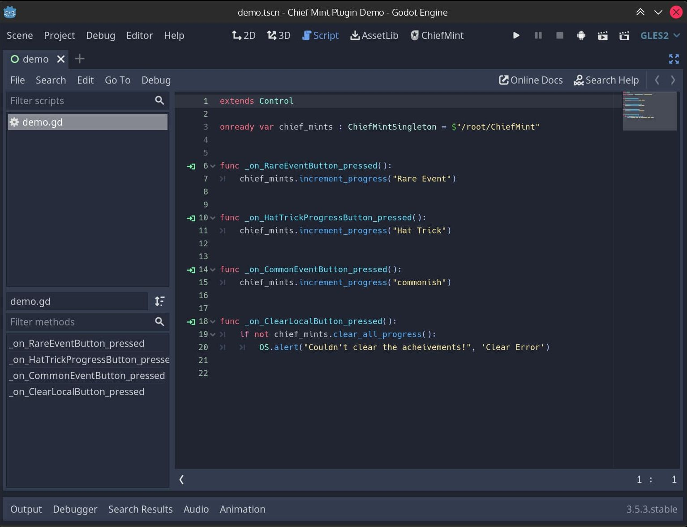

# Chief Mint: Godot Achievements

This Godot 3 add-on helps you define, track, and display in-game achievements.

"Local File Storage" achievements are good for an self-distributed or Itch release, where there is no platform-native system.

Other platforms, such as Steam, should be easy to implement (Pull-Requests welcomed) - you just need to extend "ChiefMintSource".

## In Editor

First, setup where you want your mint definitions to live, and what your editor source script/path will be.

Then, Define all of your achievements (mints), and save them.

## In Game

You can use or create a variant of the simple notification UI, "ChiefMintSimpleUI".

During the course of your game's logic, you will want to grab the Chief Mint Singleton, and register some progress on that event.

